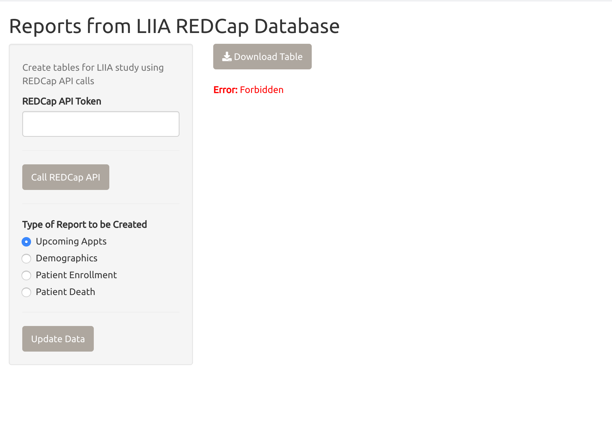
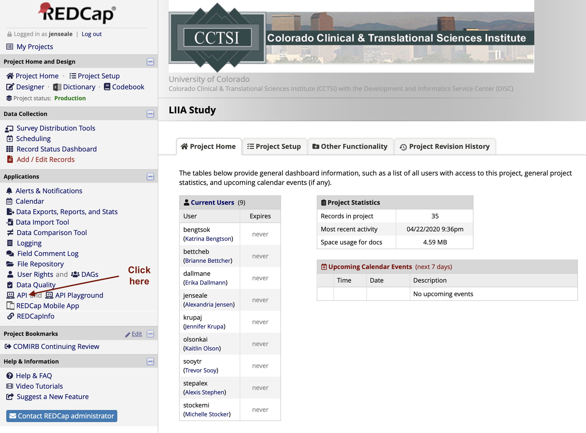
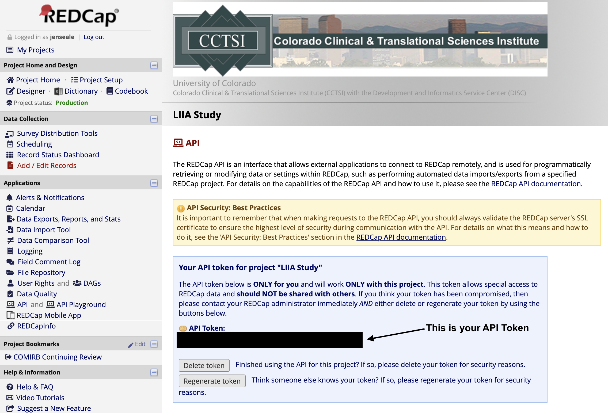

# LIIA_Shiny -- A `shiny` app to Accompany the LIIA REDCap Database

The LIIA `shiny` application provides a streamlined way to access and summarize data collected via the accompanying REDCap database. While REDCap offers a variety of download options, its ability to produce summary statistics or conditional datasets is limited.

# Getting Started

To run the app locally, it is straightforward to initiate an instance of LIIA_Shiny using the 3 steps below (it is assumed that R is installed and an internet connection is available):

1) Open an R session
2) Make sure `shiny` is installed and loaded:

`if(!require(shiny)) install.packages('shiny')`  
`library(shiny)`

3) Run the code: 

`
runGitHub("aljensen89/LIIA_Shiny")
`

Note that the app is optimized for Google Chrome, and some features may be limited in other browsers. Additionally, the first time this is run on a new machine may take a minute to install the required packages.

# Using the Application

The overall structure of the application is evident from the screenshot above. First, a user enters his/her REDCap API token. If you don't already have an API token, log into UC Denver's REDCap, go to the LIIA Study database, and click on the API option along the lefthandside options.

Your REDCap API token will be a long string of numbers and letters. It is essential that you keep your API token secret; this token is unique to your access to the LIIA database. If you believe your token has been compromised, you are welcome to request a new, regenerated token through REDCap.

